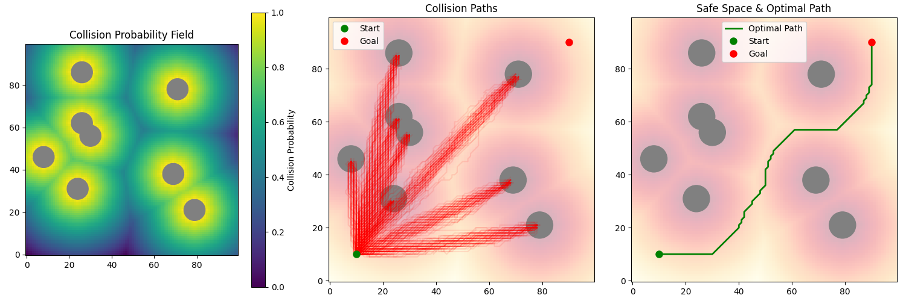
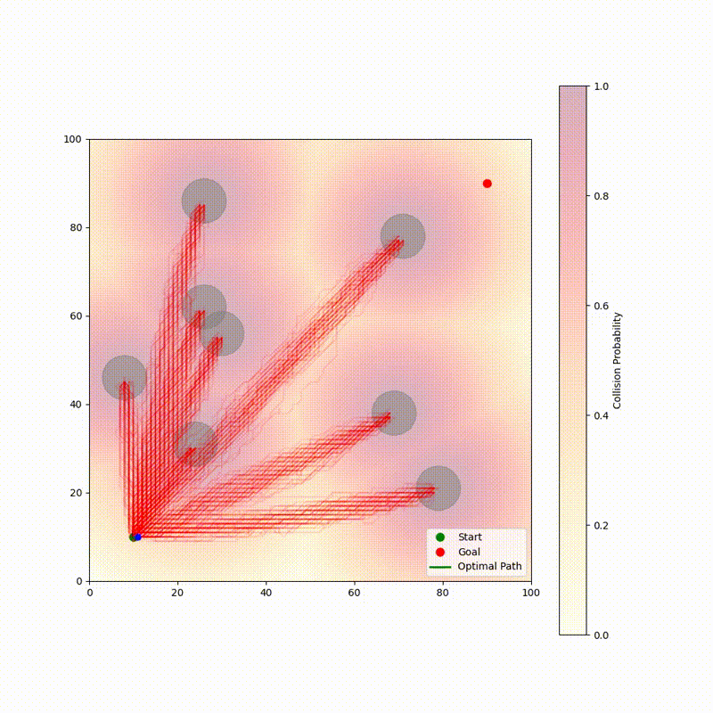

# 🚀 ROCKET
## Reverse Obstacle Collision Knowledge for Enhanced Trajectories

### Environment and Path Planning Visualization


### Path Planning Animation


ROCKET is an innovative path planning system that uses inverse collision sampling to find safe and efficient trajectories in complex environments. Instead of directly searching for safe paths, ROCKET first identifies paths that would collide with obstacles and then uses this knowledge to find optimal trajectories in the remaining safe space.

https://github.com/yourusername/ROCKET/assets/path_animation.mp4

## 🎯 Key Features

- **Inverse Collision Sampling**: Instead of directly searching for safe paths, ROCKET identifies collision paths first
- **Probabilistic Safety Field**: Creates a continuous safety field around obstacles
- **Adaptive Safety Thresholding**: Automatically adjusts safety thresholds to find viable paths
- **Interactive Visualization**: Real-time visualization of:
  - Collision probability field
  - Sample collision paths
  - Optimal safe trajectory
- **Animation Generation**: Creates smooth animations of the path planning process

## 🔧 How It Works

1. **Environment Setup**
   - Creates a grid-based environment with randomly placed obstacles
   - Defines start and goal positions
   - Configurable grid size and obstacle parameters

2. **Collision Field Generation**
   - Generates a probability field representing collision likelihood
   - Uses distance transforms to create smooth safety gradients
   - Adapts safety thresholds until a viable path is found

3. **Path Planning**
   - Samples paths that would collide with obstacles
   - Uses this information to identify safe regions
   - Applies A* search in the safe space to find optimal paths
   - Ensures paths maintain safe distances from obstacles

## 🛠️ Installation

1. Clone the repository:
```bash
git clone https://github.com/bishoymoussa/ROCKET.git
cd ROCKET
```

2. Create and activate a virtual environment:
```bash
python -m venv venv
source venv/bin/activate  # On Windows: venv\Scripts\activate
```

3. Install dependencies:
```bash
pip install -r requirements.txt
```

## 🚀 Usage

Run the main simulation:
```python
python simulate.py
```

To run with randomized obstacles:
```python
python simulate.py --random
```

## 📊 Output

The simulation produces three types of visualizations:

1. **Real-time Plot** (shown above):
   - Left: Collision probability field
   - Center: Sample collision paths
   - Right: Optimal path in safe space

2. **Animation**:
   - Shows the path planning process
   - Visualizes how the optimal path avoids high-risk areas
   - Saved as 'path_animation.mp4'

3. **Statistics**:
   - Path length
   - Average safety margin
   - Computation time for each step

## 🔬 Technical Details

### Core Components

1. **InverseCollisionPlanner**:
   - Main class handling path planning and visualization
   - Uses probabilistic sampling for collision detection
   - Implements adaptive safety thresholding

2. **Path Generation**:
   - Uses randomized sampling with controlled variance
   - Applies smoothing and interpolation for natural paths
   - Ensures path continuity and feasibility

3. **Optimization**:
   - Balances path length vs. safety margin
   - Uses dynamic programming for efficient path finding
   - Implements backtracking for robust solution finding

## 📝 License

This project is licensed under the MIT License - see the LICENSE file for details.

## 🤝 Contributing

Contributions are welcome! Please feel free to submit a Pull Request.
